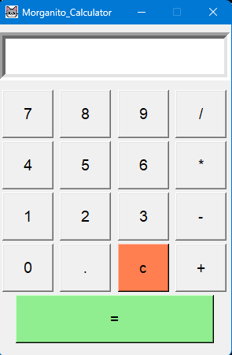

# Morgan Calculator – Calculadora de escritorio en Python

## Descripción

Morgan Calculator es una calculadora de escritorio desarrollada en Python con interfaz gráfica utilizando Tkinter.  
El proyecto incluye efectos de sonido con Pygame, ícono personalizado y una interfaz simple orientada a la experiencia del usuario.

Este proyecto fue creado como práctica de desarrollo en Python, manejo de interfaces gráficas y organización de proyectos.

---

## Tecnologías utilizadas

- **Python** → Lenguaje principal
- **Tkinter** → Interfaz gráfica
- **Pygame** → Sonido al presionar botones

---

## Características

- Interfaz gráfica desarrollada con Tkinter
- Operaciones matemáticas básicas:
  - Suma
  - Resta
  - Multiplicación
  - División
- Sonido al presionar el botón de cálculo
- Ícono personalizado para la aplicación
- Ventana con diseño simple y limpio

---

## Captura



---

## Cómo correr el proyecto

Para ejecutar la aplicación en tu computadora:

```bash
git clone https://github.com/DSGProjects/Morgan-Calculator
cd Morgan-Calculator
pip install pygame
python "Morgan Calculator.py"

```

---
## Estructura del proyecto

Morgan-Calculator  
│  
├── Morgan Calculator.py → Código principal de la aplicación  
├── click.wav → Sonido utilizado al presionar botones  
├── Morgan.png → Ícono de la aplicación  
├── Morgancapt.png → Captura de pantalla del programa  
├── README.md → Documentación del proyecto  
└── LICENSE → Licencia del proyecto
---

## Detalles técnicos

La aplicación utiliza **Tkinter** para la creación de la interfaz gráfica y **Pygame** para reproducir efectos de sonido al interactuar con los botones.

Las operaciones matemáticas se ejecutan mediante eventos que se activan cuando el usuario presiona los botones de la interfaz. El resultado se muestra dinámicamente en la pantalla de la aplicación.

La estructura del proyecto separa los recursos visuales y de audio del archivo principal de código para mantener una organización clara del proyecto.

---

## Autor
**David Fernando Solano Garcia** - Analista de Datos & QA Junior

LinkedIn: https://www.linkedin.com/in/david-fernando-solano-garcia-840230348
